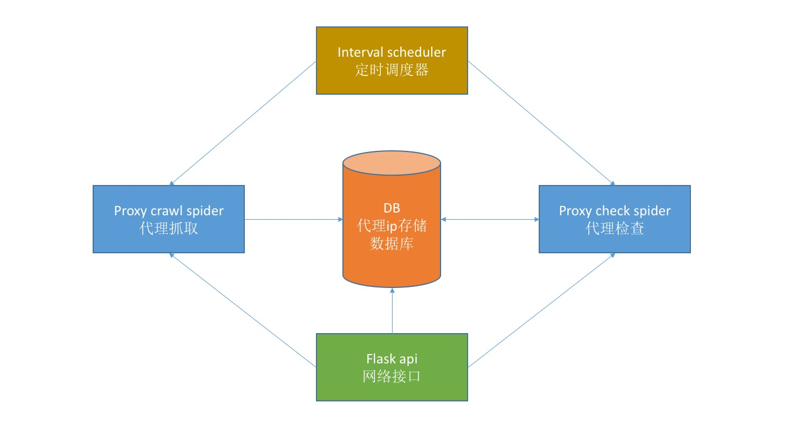

# 项目说明：
FreeIpProxy抓取公开代理ip，并采用评分制维护代理ip池，对外提供使用接口

推荐使用python3



## 文件目录
```
├── README.md
├── check.py          代理ip有效性检查
├── config.py         全局参数配置
├── main.py           程序入口
├── models.py         数据库交互
├── proxy.db          ip存储，采用sqlite，可以在models模块中替换为其他数据库
├── proxy_source.py   代理ip抓取网站xpath配置
├── scheduler.py      定时任务调度，抓取代理ip和检测代理ip有效性
├── spider.py         抓取代理ip
└── utils.py          小工具

```

## 采用flask提供接口：

(1)获取1个代理ip

GET http://127.0.0.1:5000/get

按照分数值score排序，返回最高的一个值

```
{
    id: 127,
    ip: "119.27.177.169",
    port: "80",
    style: "透明",
    protocol: "HTTP",
    address: "福建省厦门市",
    score: 14,
    source: "89ip代理",
    md5: "9352df7efc296b1bdad2047e0c15b3a6",
    create_time: "2018-09-05 15:32:49",
    update_time: "2018-09-05 17:52:04"
}
```

(2)获取多个代理ip

GET http://127.0.0.1:5000/get_list/2

最后一位为数量

```
[
    {
        id: 127,
        ip: "119.27.177.169",
        port: "80",
        style: "透明",
        protocol: "HTTP",
        address: "福建省厦门市",
        score: 14,
        source: "89ip代理",
        md5: "9352df7efc296b1bdad2047e0c15b3a6",
        create_time: "2018-09-05 15:32:49",
        update_time: "2018-09-05 17:52:04"
    },
    {
        id: 122,
        ip: "47.100.196.200",
        port: "3128",
        style: "透明",
        protocol: "HTTP",
        address: "上海市",
        score: 11,
        source: "89ip代理",
        md5: "715de3a3237e2116e6c8a1a17f27278b",
        create_time: "2018-09-05 15:32:49",
        update_time: "2018-09-05 17:52:09"
    }
]
```
(3)手动抓取

GET http://127.0.0.1:5000/crawl

(4)手动检查

GET http://127.0.0.1:5000/check

(5)手动删除

GET http://127.0.0.1:5000/delete/8

最后一位为返回数据中的id

